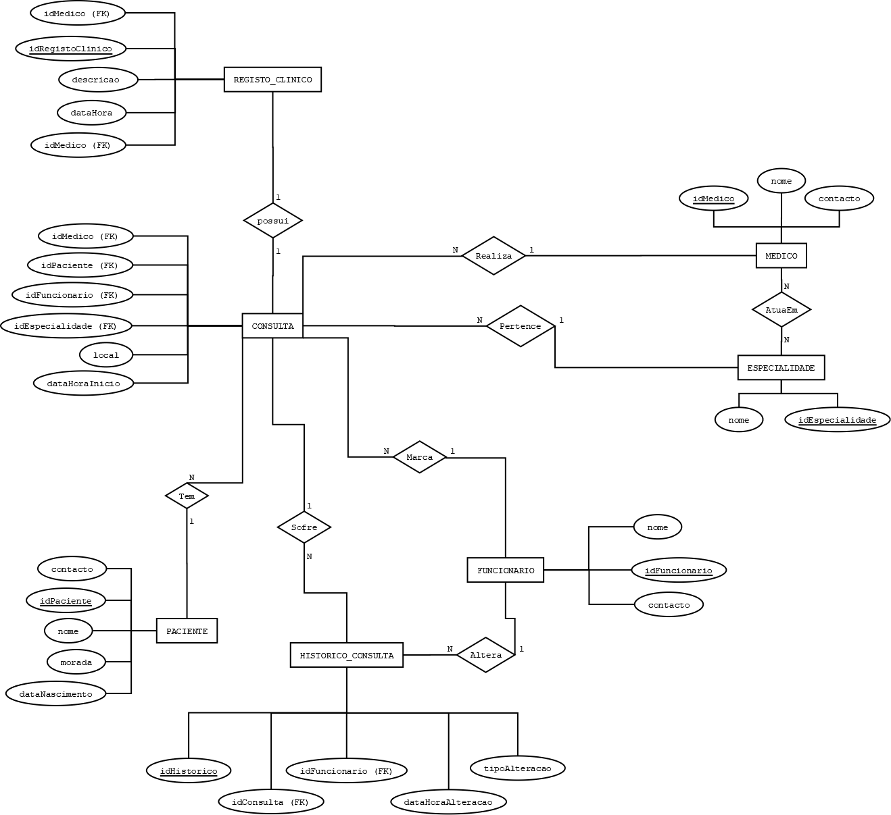

# C3 : Esquema conceptual

## Modelo E/A
_(Introduzir as entidade-tipo e associações do sistema, adicionalmente apresentar o diagrama do modelo Entidade-Associação.)_

Exemplo de inserção de uma imagem:   
   

Paciente
Representa um utente da clínica. Cada paciente possui um código único (idPaciente), assim como o seu nome, morada, data de nascimento e contacto. Esta entidade armazena as informações necessárias para agendar e associar consultas a cada indivíduo.

Médico
Representa um profissional de saúde que realiza consultas na clínica. Cada médico possui um código único (idMedico), nome e contacto. Os médicos estão também associados a especialidades médicas através da relação "AtuaEm" com a entidade "Especialidade".

Especialidade
Contém a lista de especializações médicas disponíveis na clínica. Cada especialidade tem um código único (idEspecialidade) e um nome. Esta entidade permite organizar os médicos e consultas.

Funcionário
Representa um trabalhador administrativo da clínica. Cada funcionário tem um código único (idFuncionario), um nome e um contacto. Embora não participe diretamente na consulta médica, é responsável por tarefas como o agendamento e receção de pacientes.

Consulta
Representa um agendamento entre um paciente e um médico para uma especialidade específica. Contém o código da consulta (idConsulta) e os códigos do paciente, médico e especialidade (como FKs), bem como a data e hora de início da consulta e local.

## Regras de negócio adicionais (Restrições)
- Um médico não pode ter duas consultas sobrepostas no mesmo horário.
- A duração da consulta é definida pela especialidade e usada para evitar sobreposições.
- O sistema deve permitir reagendamento e cancelamento, mantendo o histórico de alterações.
- A chegada do paciente deve notificar automaticamente o médico.

---
[< Previous](rei02.md) | [^ Main](/../../) | Next >
:--- | :---: | ---: 
