# C8 : Postman

---
## Estrutura

A coleção foi organizada por entidades:

- [PACIENTE](#PACIENTE)
- [MEDICO](#MEDICO)
- [FUNCIONARIO](#FUNCIONARIO)
- [ESPECIALIDADE](#ESPECIALIDADE)
- [CONSULTA](#CONSULTA)
- [REGISTO_CLINICO](#REGISTO_CLINICO)
- [HISTORICO_CONSULTA](#HISTORICO_CONSULTA)

### PACIENTE

Inclui apenas `GET` e `POST` uma vez que são os principais métodos que seriam utilizados. Poderia também ser utilizado o método CRUD `PATCH` mas seria utilizado muito esporádicamente.

| Endpoint | Justificação |
|----------|--------------|
| `GET /pacientes` | Listar pacientes |
| `GET /pacientes/:id` | Ver paciente por id |
| `POST /pacientes`| Criar paciente |

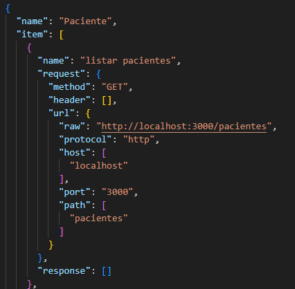

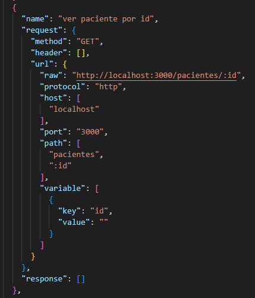

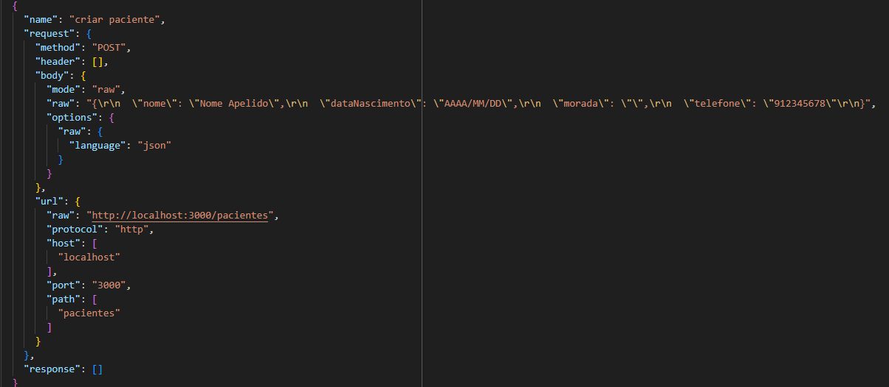

### MEDICO

Inclui apenas `GET` e `POST` uma vez que são os principais métodos que seriam utilizados. Poderia também ser utilizado o método CRUD `PATCH` mas seria utilizado muito esporádicamente.

| Endpoint | Justificação |
|----------|--------------|
| `GET /medicos` | Listar medicos |
| `POST /medicos`| Criar medico |

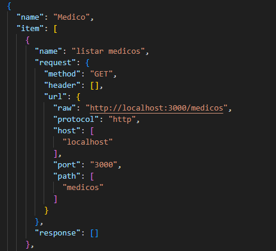

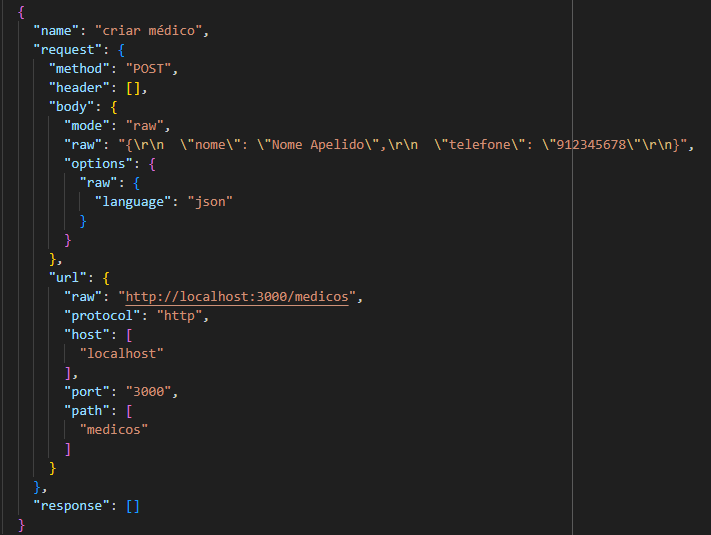

### FUNCIONARIO

Inclui apenas `GET` e `POST` uma vez que são os principais métodos que seriam utilizados. Poderia também ser utilizado o método CRUD `PATCH` mas seria utilizado muito esporádicamente.

| Endpoint | Justificação |
|----------|--------------|
| `GET /funcionarios` | Listar funcionarios |
| `POST /funcionarios`| Criar funcionario |

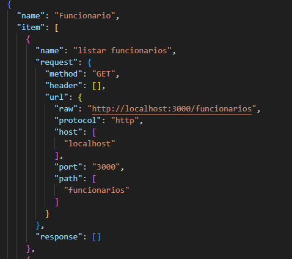

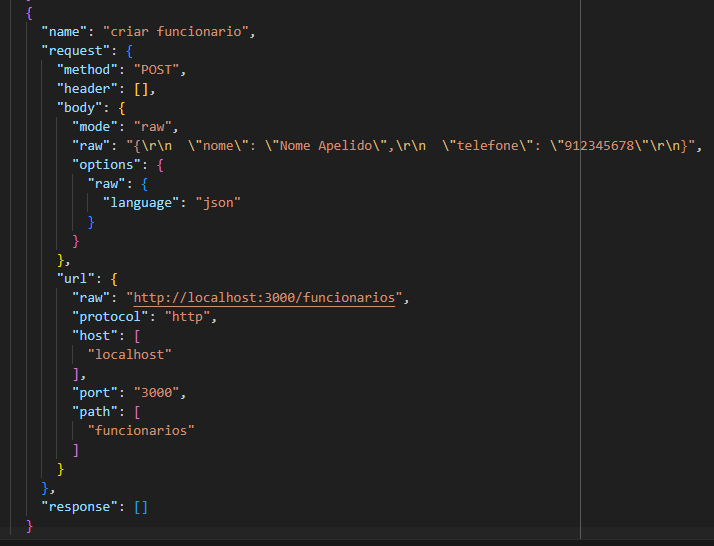

### ESPECIALIDADE

Inclui apenas `GET` e `POST` uma vez que são os principais métodos que seriam utilizados. Poderia também ser utilizado o método CRUD `PATCH` mas seria utilizado muito esporádicamente.

| Endpoint | Justificação |
|----------|--------------|
| `GET /especialidades` | Listar especialidades |
| `POST /especialidades`| Criar especialidade |

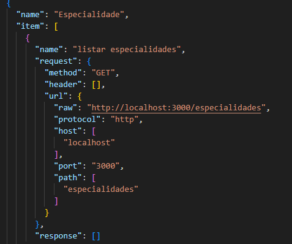

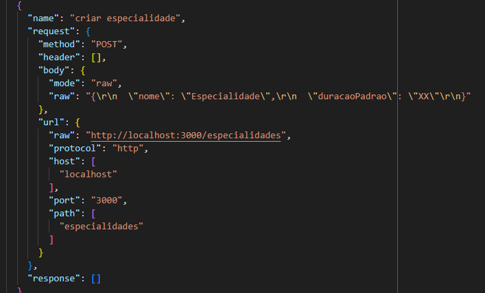

### CONSULTA

Inclui os métodos CRUD `GET`, `POST`, `PATCH` e `DELETE`

| Endpoint | Justificação |
|----------|--------------|
| `GET /consultas` | Listar consultas |
| `GET /consultas/:id` | Ver consulta por id |
| `POST /consultas`| Criar consulta |
| `PATCH /consultas/:id` | Atualizar consulta |
| `DELETE /consultas/:id`| Apagar consulta |

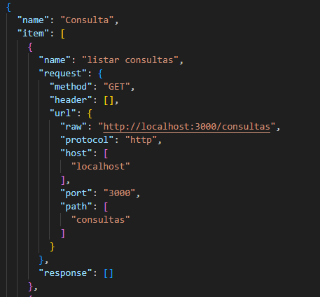

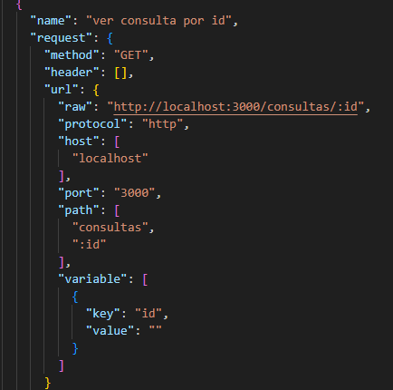

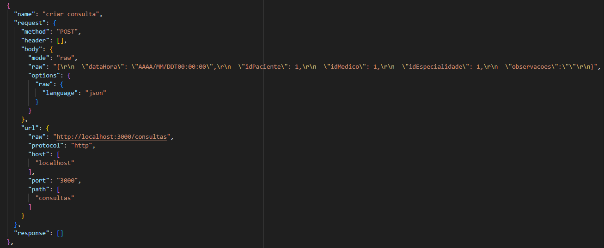

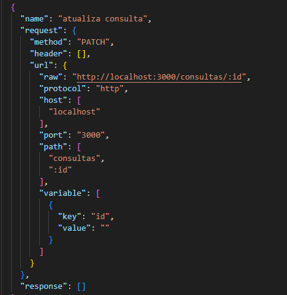

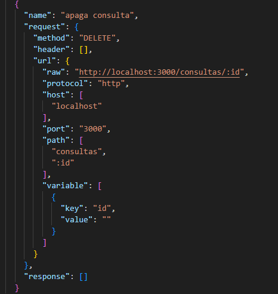

### REGISTO_CLINICO

Inclui apenas `GET` uma vez que é o único método CRUD útil para esta entidade.

| Endpoint | Justificação |
|----------|--------------|
| `GET /consultas/:id/registo-clinico` | Obter registo clinico de consulta |

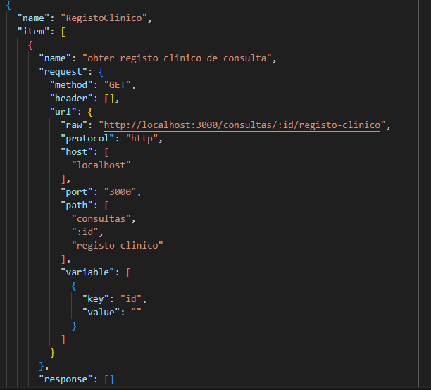

### HISTORICO_CONSULTA

Inclui apenas `GET` uma vez que é o único método CRUD útil para esta entidade.

| Endpoint | Justificação |
|----------|--------------|
| `GET /historico-consultas` | Listar histórico de consultas |
| `GET /consultas/:id/alteracoes` | Obter alteracoes feitas numa consulta |

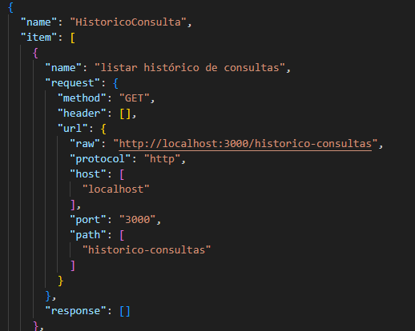

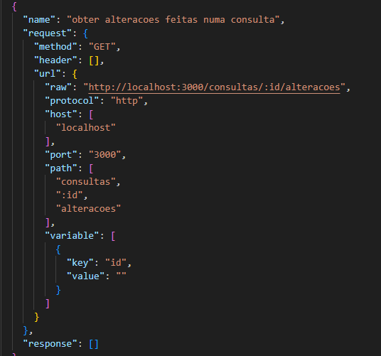

---
[< Previous](rpf07.md) | [^ Main](/../../) | Next >
